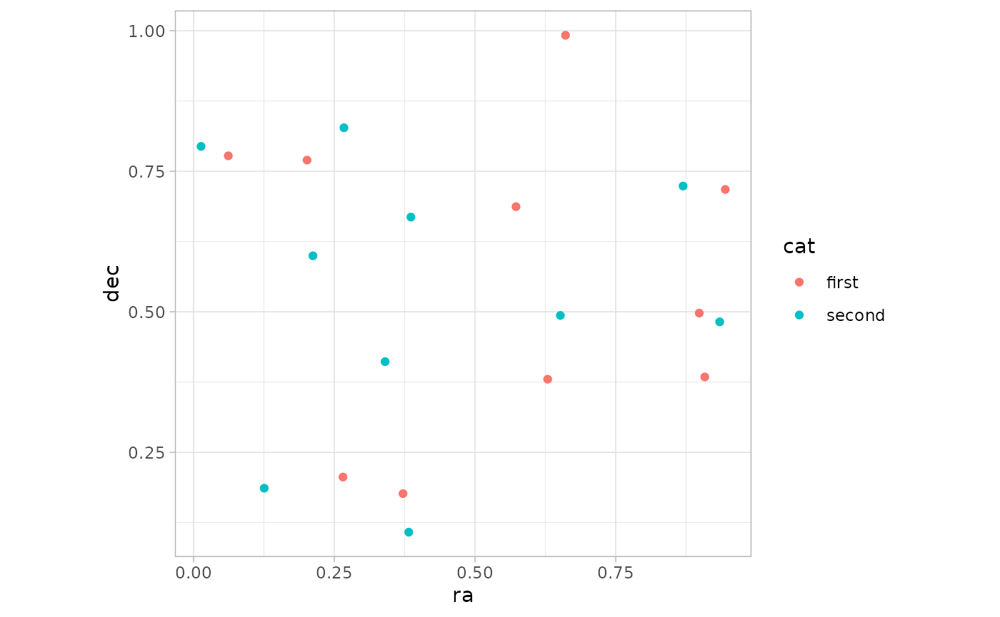
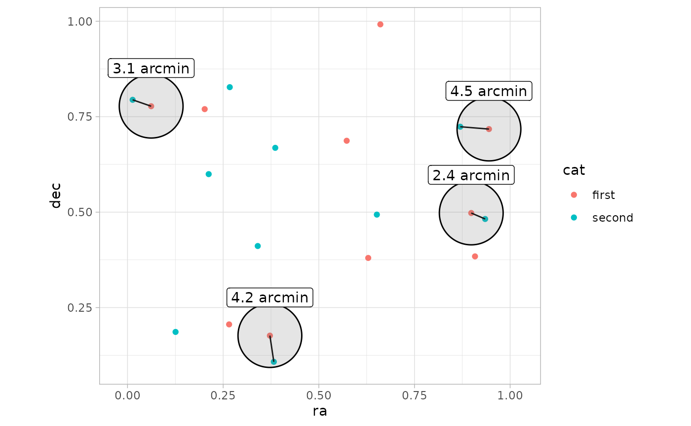
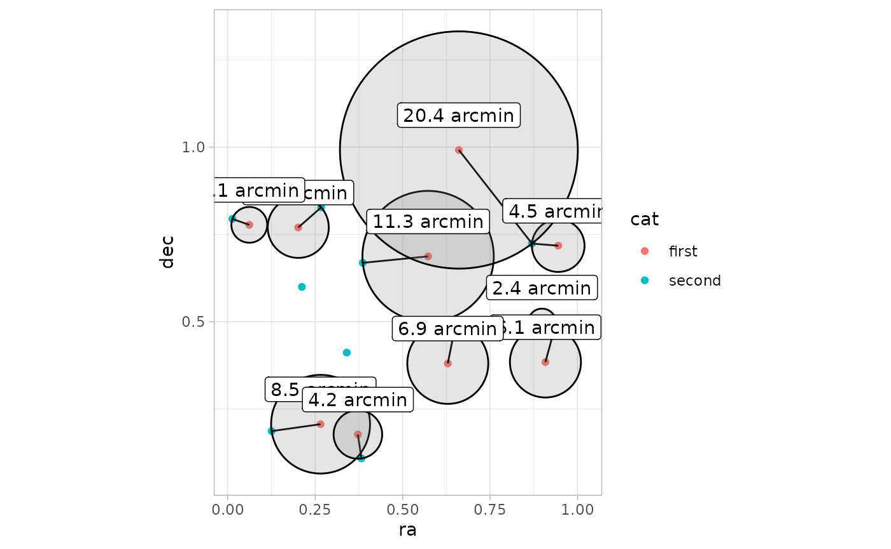
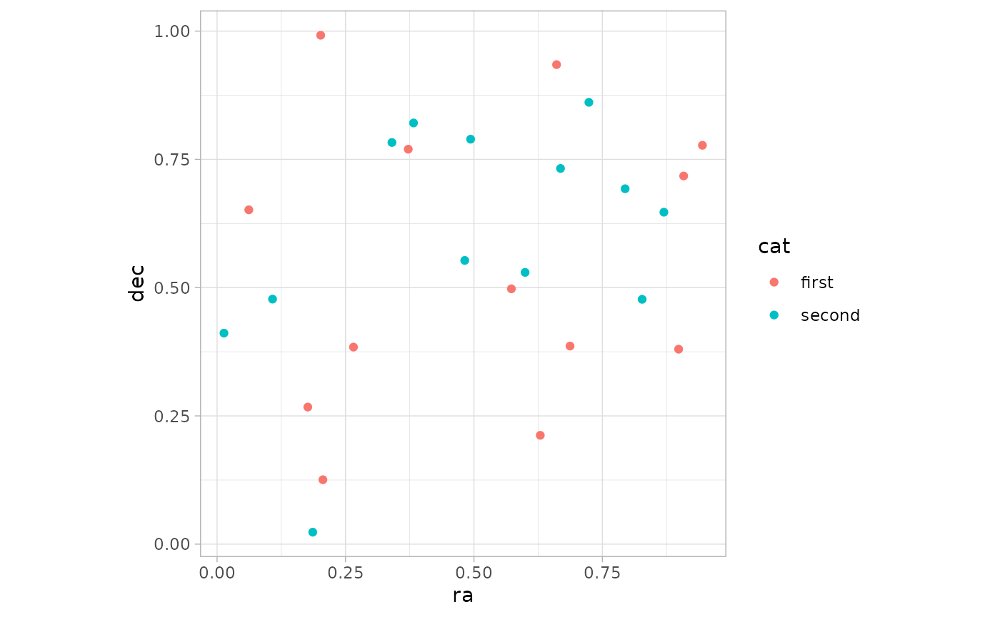
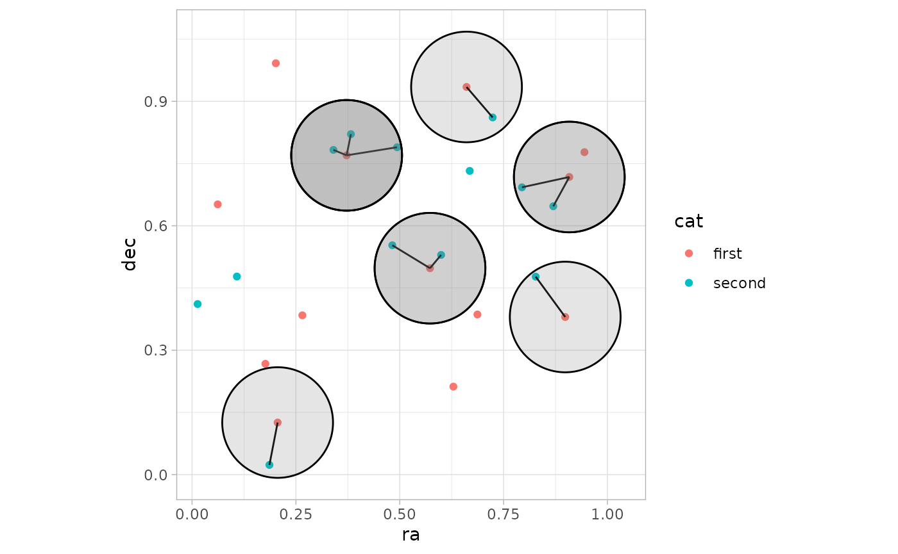
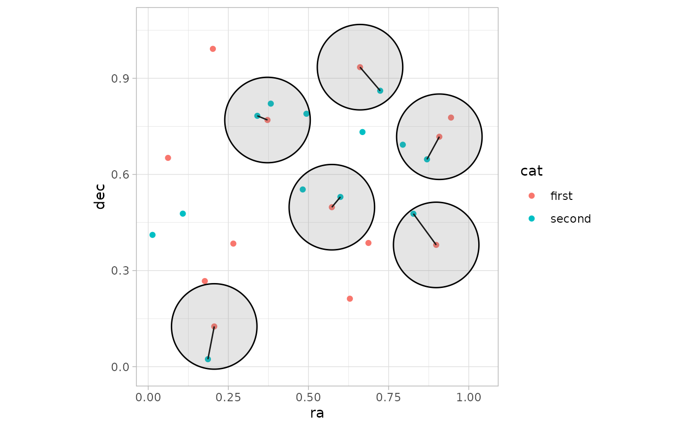

# Catalog matching joins

``` r
library(astrocoords)
#> 
#> Attaching package: 'astrocoords'
#> The following object is masked from 'package:graphics':
#> 
#>     frame
library(ggplot2)
theme_set(theme_light())
```

### TL;DR

- [`coord_inner_join()`](https://uskovgs.github.io/astrocoords/reference/coord_left_join.md)
  keeps only rows from `x` that have matches in `y` within `max_sep`.
- [`coord_left_join()`](https://uskovgs.github.io/astrocoords/reference/coord_left_join.md)
  keeps all rows from `x`; unmatched rows get `NA` from `y`.
- [`coord_right_join()`](https://uskovgs.github.io/astrocoords/reference/coord_left_join.md)
  keeps all rows from `y`; unmatched rows get `NA` from `x`.
- [`coord_full_join()`](https://uskovgs.github.io/astrocoords/reference/coord_left_join.md)
  keeps all rows from both tables.
- [`coord_nearest_join()`](https://uskovgs.github.io/astrocoords/reference/coord_left_join.md)
  returns one nearest match in `y` for each row in `x`.
- `multiple = "all"` keeps all matches inside the radius, while
  `multiple = "closest"` keeps only one match per row in `x`.

## Understanding joins

``` r
set.seed(1)
N <- 10
df1 <- data.frame(
  ra = runif(N), 
  dec = runif(N),
  cat = "first"
)
df2 <- data.frame(
  ra = runif(N), 
  dec = runif(N),
  cat = "second"
)

df12 <- do.call(rbind, list(df1, df2))
df1$sc <- ra_dec(df1$ra, df1$dec)
df2$sc <- ra_dec(df2$ra, df2$dec)

df12$sc <- c(df1$sc, df2$sc)

p1 <- df12 |>
  ggplot(aes(ra, dec, color = cat)) +
  geom_point() +
  coord_fixed(ratio = 1)
p1
```



### Inner join within radius

``` r
df12_intersect <- df1 |>
  coord_inner_join(df2, max_sep = 5, unit = "arcmin")

p1 +
  geom_segment(
    data = df12_intersect,
    aes(x = ra.x, xend = ra.y, y = dec.x, yend = dec.y),
    color = "black"
  ) +
  ggforce::geom_circle(
    data = df12_intersect,
    aes(x0 = ra.x, y0 = dec.x, r= 5/60),
    fill = "grey50",
    alpha = 0.2,
    inherit.aes = FALSE
  ) +
    geom_label(
      data = df12_intersect,
      aes(ra.x, dec.x + 0.1, label = paste(round(sep, 1), "arcmin")),
      inherit.aes = FALSE,      
    )
```



### Nearest-neighbor join

``` r
df12_nearest <- df1 |>
  coord_nearest_join(df2, unit = "arcmin") 

p1 +
  geom_segment(
    data = df12_nearest,
    aes(x = ra.x, xend = ra.y, y = dec.x, yend = dec.y),
    color = "black"
  ) +
  ggforce::geom_circle(
    data = df12_nearest,
    aes(x0 = ra.x, y0 = dec.x, r = sep/60),
    fill = "grey50",
    alpha = 0.2,
    inherit.aes = FALSE
  ) +
    geom_label(
      data = df12_nearest,
      aes(ra.x, dec.x + 0.1, label = paste(round(sep, 1), "arcmin")),
      inherit.aes = FALSE
    )
```



### Left vs right vs full join

``` r
df1 |>
  coord_left_join(df2, max_sep = 5, unit = "arcmin")
#>          ra.x     dec.x cat.x                     sc       ra.y     dec.y
#> 1  0.26550866 0.2059746 first 00h01m03.7s +00°12'22"         NA        NA
#> 2  0.37212390 0.1765568 first 00h01m29.3s +00°10'36" 0.38238796 0.1079436
#> 3  0.57285336 0.6870228 first 00h02m17.5s +00°41'13"         NA        NA
#> 4  0.90820779 0.3841037 first 00h03m38.0s +00°23'03"         NA        NA
#> 5  0.20168193 0.7698414 first 00h00m48.4s +00°46'11"         NA        NA
#> 6  0.89838968 0.4976992 first 00h03m35.6s +00°29'52" 0.93470523 0.4820801
#> 7  0.94467527 0.7176185 first 00h03m46.7s +00°43'03" 0.86969085 0.7237109
#> 8  0.66079779 0.9919061 first 00h02m38.6s +00°59'31"         NA        NA
#> 9  0.62911404 0.3800352 first 00h02m31.0s +00°22'48"         NA        NA
#> 10 0.06178627 0.7774452 first 00h00m14.8s +00°46'39" 0.01339033 0.7942399
#>     cat.y      sep
#> 1    <NA>       NA
#> 2  second 4.162595
#> 3    <NA>       NA
#> 4    <NA>       NA
#> 5    <NA>       NA
#> 6  second 2.371845
#> 7  second 4.513536
#> 8    <NA>       NA
#> 9    <NA>       NA
#> 10 second 3.073374
```

``` r
df1 |>
  coord_right_join(df2, max_sep = 5, unit = "arcmin")
#>          ra.x     dec.x cat.x                     sc       ra.y     dec.y
#> 1  0.89838968 0.4976992 first 00h03m35.6s +00°29'52" 0.93470523 0.4820801
#> 2          NA        NA  <NA>                     NA 0.21214252 0.5995658
#> 3          NA        NA  <NA>                     NA 0.65167377 0.4935413
#> 4          NA        NA  <NA>                     NA 0.12555510 0.1862176
#> 5          NA        NA  <NA>                     NA 0.26722067 0.8273733
#> 6          NA        NA  <NA>                     NA 0.38611409 0.6684667
#> 7  0.06178627 0.7774452 first 00h00m14.8s +00°46'39" 0.01339033 0.7942399
#> 8  0.37212390 0.1765568 first 00h01m29.3s +00°10'36" 0.38238796 0.1079436
#> 9  0.94467527 0.7176185 first 00h03m46.7s +00°43'03" 0.86969085 0.7237109
#> 10         NA        NA  <NA>                     NA 0.34034900 0.4112744
#>     cat.y      sep
#> 1  second 2.371845
#> 2  second       NA
#> 3  second       NA
#> 4  second       NA
#> 5  second       NA
#> 6  second       NA
#> 7  second 3.073374
#> 8  second 4.162595
#> 9  second 4.513536
#> 10 second       NA
```

``` r
df1 |>
  coord_full_join(df2, max_sep = 5, unit = "arcmin")
#>          ra.x     dec.x cat.x                     sc       ra.y     dec.y
#> 1  0.26550866 0.2059746 first 00h01m03.7s +00°12'22"         NA        NA
#> 2  0.37212390 0.1765568 first 00h01m29.3s +00°10'36" 0.38238796 0.1079436
#> 3  0.57285336 0.6870228 first 00h02m17.5s +00°41'13"         NA        NA
#> 4  0.90820779 0.3841037 first 00h03m38.0s +00°23'03"         NA        NA
#> 5  0.20168193 0.7698414 first 00h00m48.4s +00°46'11"         NA        NA
#> 6  0.89838968 0.4976992 first 00h03m35.6s +00°29'52" 0.93470523 0.4820801
#> 7  0.94467527 0.7176185 first 00h03m46.7s +00°43'03" 0.86969085 0.7237109
#> 8  0.66079779 0.9919061 first 00h02m38.6s +00°59'31"         NA        NA
#> 9  0.62911404 0.3800352 first 00h02m31.0s +00°22'48"         NA        NA
#> 10 0.06178627 0.7774452 first 00h00m14.8s +00°46'39" 0.01339033 0.7942399
#> 11         NA        NA  <NA>                     NA 0.21214252 0.5995658
#> 12         NA        NA  <NA>                     NA 0.65167377 0.4935413
#> 13         NA        NA  <NA>                     NA 0.12555510 0.1862176
#> 14         NA        NA  <NA>                     NA 0.26722067 0.8273733
#> 15         NA        NA  <NA>                     NA 0.38611409 0.6684667
#> 16         NA        NA  <NA>                     NA 0.34034900 0.4112744
#>     cat.y      sep
#> 1    <NA>       NA
#> 2  second 4.162595
#> 3    <NA>       NA
#> 4    <NA>       NA
#> 5    <NA>       NA
#> 6  second 2.371845
#> 7  second 4.513536
#> 8    <NA>       NA
#> 9    <NA>       NA
#> 10 second 3.073374
#> 11 second       NA
#> 12 second       NA
#> 13 second       NA
#> 14 second       NA
#> 15 second       NA
#> 16 second       NA
```

## Multiple matches: all vs closest

``` r
set.seed(1)

N <- 13
df1 <- data.frame(
  ra = runif(N), 
  dec = runif(N),
  cat = "first"
)
df2 <- data.frame(
  ra = runif(N), 
  dec = runif(N),
  cat = "second"
)

df12 <- do.call(rbind, list(df1, df2))
df1$sc <- ra_dec(df1$ra, df1$dec)
df2$sc <- ra_dec(df2$ra, df2$dec)

df12$sc <- c(df1$sc, df2$sc)

p1 <- df12 |>
  ggplot(aes(ra, dec, color = cat)) +
  geom_point() +
  coord_fixed(ratio = 1)
p1
```



### `multiple="all"`

``` r
MAX_SEP <- 8
df12_intersect <- df1 |>
  coord_inner_join(df2, max_sep = MAX_SEP, unit = "arcmin")

p1 +
  geom_segment(
    data = df12_intersect,
    aes(x = ra.x, xend = ra.y, y = dec.x, yend = dec.y),
    color = "black"
  ) +
  ggforce::geom_circle(
    data = df12_intersect,
    aes(x0 = ra.x, y0 = dec.x, r = MAX_SEP/60),
    fill = "grey50",
    alpha = 0.2,
    inherit.aes = FALSE
  )
```



### `multiple="closest"`

``` r
df12_intersect <- df1 |>
  coord_inner_join(df2, max_sep = MAX_SEP, unit = "arcmin", multiple = "closest")

p1 +
  geom_segment(
    data = df12_intersect,
    aes(x = ra.x, xend = ra.y, y = dec.x, yend = dec.y),
    color = "black"
  ) +
  ggforce::geom_circle(
    data = df12_intersect,
    aes(x0 = ra.x, y0 = dec.x, r= MAX_SEP/60),
    fill = "grey50",
    alpha = 0.2,
    inherit.aes = FALSE
  )
```


